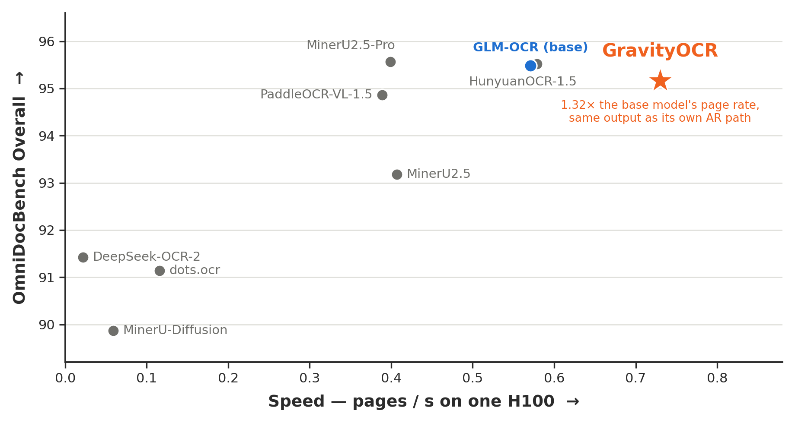
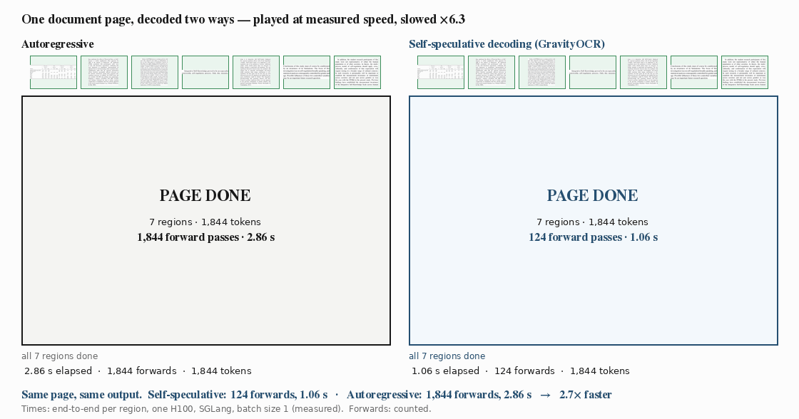

<div align="center">

# GravityOCR

**Diffusion Drafts, AR Verifies: Accelerating Document OCR with Self-Speculative Decoding**

[](https://github.com/trillion-labs/GravityOCR/releases)
[](https://huggingface.co/trillionlabs/GravityOCR)
[](LICENSE)

One set of weights drafts a whole block of tokens with block diffusion and verifies it with its own
autoregressive path — the AR output, several tokens per forward pass.

**To run it, open [`AGENTS.md`](AGENTS.md)** — setup, serving, in-process inference and evaluation, step by
step. Hand it to your coding agent or follow it yourself.

</div>

<p align="center"></p>

<p align="center"><sub>OmniDocBench v1.6 Overall against single-stream page rate on one H100, every system measured by us on the same boundary. GravityOCR keeps the base model's accuracy and is the fastest.</sub></p>

## See it decode

<p align="center"></p>

<p align="center"><sub>One OmniDocBench page, seven regions, same weights. Both panels play at their <b>measured</b> per-region times — vision encoding, prefill and decoding through the SGLang server on one H100, batch size 1; layout detection not included — slowed 6.3× so you can watch. Self-speculative decoding finishes the page in 1.06 s and 124 forward passes; autoregressive needs 2.86 s and 1,844.</sub></p>

## How it works

<p align="center"></p>

One round, two forward passes, no extra parameters:

1. **Draft** — append `B` mask tokens to the boundary token `x₀` and run one forward. It returns a causal
   token `a₀` and `B` draft tokens `d₁…d_B`, predicted in parallel by block diffusion.
2. **Verify** — one causal forward over `[a₀, d₁…d_B]` gives the AR predictions `a₁…a_{B+1}`. Commit `a₀`,
   the longest draft prefix with `dⱼ = aⱼ`, then `a_{A+1}` — up to `B+2` tokens per round, and in exact
   arithmetic exactly what the AR path would have produced.

The verifier *is* the drafter: joint AR–diffusion training puts both paths on the same weights, and GRPO
on the AR path then improves accuracy without touching drafting efficiency.

## Results

OmniDocBench v1.6, official protocol. Speed: SGLang, one H100, batch size 1.

| Model | Decode | Overall ↑ | Tokens / forward ↑ | Pages / s ↑ |
|---|---|---|---|---|
| GLM-OCR (base) | AR | 95.48 | 1.0 | 0.571 |
| GravityOCR | AR | 95.16 | 1.0 | 0.554 |
| **GravityOCR** | **self-speculative** | **95.16** | **9.7** | **0.730** |

- **1.32×** more pages per second than the AR path, identical output → same score.
- On region crops: **3.94×** decode-only, **1.74×** end to end.
- Under bf16 serving kernels the two paths agree exactly on 96.6% of crops; the rest are floating-point tie-breaks.

## Quick start

```bash
pip install "transformers>=5.8" torch pillow            # AR decoding needs nothing from this repo
```
```python
from transformers import AutoProcessor, GlmOcrForConditionalGeneration
processor = AutoProcessor.from_pretrained("trillionlabs/GravityOCR")
model = GlmOcrForConditionalGeneration.from_pretrained("trillionlabs/GravityOCR", torch_dtype="bfloat16", device_map="cuda")
```

Self-speculative decoding — the point of the model — needs this repository: **serve it with the SGLang
patch** (`patches/sglang/`, OpenAI-compatible endpoint) or **run it in process** (`src/infer_omnidocbench.py --spec_natcache`).
Both are written out in [`AGENTS.md`](AGENTS.md).

- **Weights:** [`trillionlabs/GravityOCR`](https://huggingface.co/trillionlabs/GravityOCR) — a standard
  `GlmOcrForConditionalGeneration` checkpoint plus `block_diffusion.json` (`bd_size`, `mask_id`, `ar_loss_weight`).
- **Serving patch:** `patches/sglang/` on SGLang v0.5.12.
- **Docs:** `docs/00_INDEX.md`.

## Citation

```bibtex
@techreport{gravityocr2026,
  title  = {Diffusion Drafts, AR Verifies: Accelerating Document OCR with Self-Speculative Decoding},
  author = {Trillion Labs},
  year   = {2026}
}
```

## License

MIT (code and released weights). GLM-OCR is MIT-licensed by Z.ai; the SGLang patch is Apache-2.0
like SGLang. See `LICENSE`.
