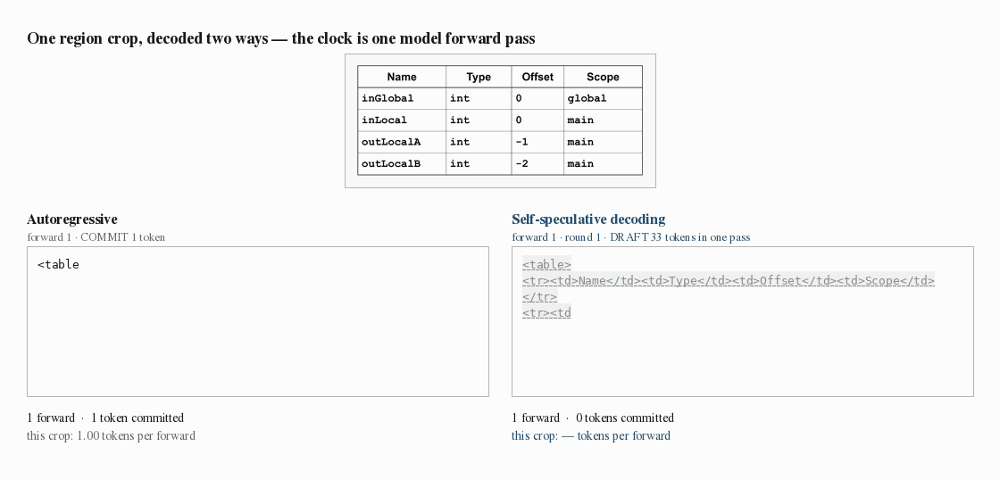
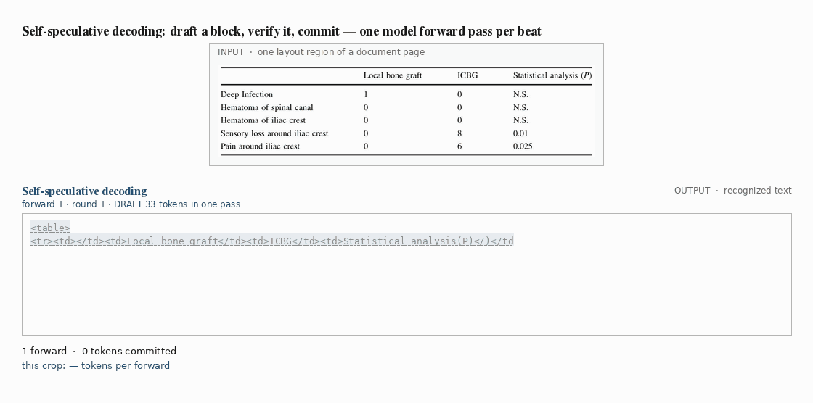

# GravityOCR — Diffusion Drafts, AR Verifies

**Accelerating document OCR with self-speculative decoding.** GravityOCR is [GLM-OCR](https://huggingface.co/zai-org/GLM-OCR)
(CogViT + 0.5B decoder) fine-tuned so that one set of weights acts as both a block-diffusion drafter and
an autoregressive verifier. The diffusion path proposes a whole block of tokens in a single forward pass;
the causal path verifies them and commits the longest prefix that matches what it would have produced
itself. In exact arithmetic the output *is* the AR greedy output — the model only gets faster.



*Left: autoregressive decoding, one token per forward. Right: the same weights decoding the same crop
self-speculatively. The forward counts are the measured ones — 150 against 10 — while the right panel is
played at one-fifth of the left panel's wall time rather than at the raw forward ratio, since a block
forward costs more than a single-token forward.*

## How it works

One round is two forward passes:

1. **Draft.** Append `B` mask tokens to the boundary token `x₀` and run one forward pass, the mask block
   attending within itself and causally to the cached prefix. That single pass returns both a causal
   token `a₀`, which conditions only on committed context, and `B` draft tokens `d₁…d_B` predicted in
   parallel — block diffusion is what lets a whole block be proposed at once, with no iterative
   unmasking and no confidence-based selection.
2. **Verify.** Run one causal forward over `[a₀, d₁…d_B]`, which yields the AR predictions `a₁…a_{B+1}`
   and, in the same pass, the KV cache for whatever is accepted. Commit `a₀`, then the longest draft
   prefix with `dⱼ = aⱼ`, then `a_{A+1}` — correct by construction, and the boundary token of the next
   round. Rejected states are discarded. A round therefore advances by up to `B+2` tokens.

Nothing outside the shared weights is involved: no drafter network, no extra prediction head, no
speculation-specific parameters. The verifier is the same model that drafts, because training optimizes
both paths at once.



*The mechanism on its own, one forward per frame: a pale block is a draft; on the verify pass the accepted
prefix turns solid while a rejected token is struck through and replaced by the verifier's own token.
Colours mark which round committed each token.*

## Results

OmniDocBench v1.6, full resolution, official protocol and page-level aggregation. Speed is SGLang, one
H100, batch size 1, the same client and page set for every row.

| Model | Decode | Overall ↑ | TPF ↑ | tok/s ↑ | pages/s ↑ |
|---|---|---|---|---|---|
| GLM-OCR (base) | AR | 95.48 | 1.0 | 807 | 0.571 |
| GravityOCR | AR | 95.16 | 1.0 | 794 | 0.554 |
| **GravityOCR** | **self-speculative** | **95.16** | **9.7** | **1,047** | **0.730** |

TPF = tokens committed per forward pass. The two GravityOCR rows score the same because they produce the
same text: **1.32× more pages per second at identical quality**. On region crops, where the per-request
fixed cost is a smaller share of the wall clock, the gain is **3.94× on decode alone** and **1.74× end to
end**. Under bf16 serving kernels the two paths agree exactly on 96.6% of crops; the rest are
floating-point tie-breaks, not algorithmic drift.

Details, ablations and the rest of the evaluation are in the paper: *Diffusion Drafts, AR Verifies:
Accelerating Document OCR with Self-Speculative Decoding* (Trillion Labs, 2026).

- **Weights:** [`trillionlabs/GravityOCR`](https://huggingface.co/trillionlabs/GravityOCR) (MIT) — a
  standard `GlmOcrForConditionalGeneration` checkpoint plus `block_diffusion.json`. Stock
  `transformers>=5.8` loads it for AR decoding; self-speculative decoding needs this repository
  (in process) or the SGLang patch (serving).
- **Serving:** `patches/sglang/` — self-speculative block-diffusion decoding on SGLang v0.5.12.

## Repository layout

```
src/            model + decoders (models/glm_ocr_dllm.py, fast_sampling.py, fast_sampling_batched.py,
                infer_omnidocbench.py, infer_odb_ar.py, layout_postprocess.py)
scripts/        eval.sh (+ _lib.sh) — the evaluation launcher; it records every run into runs/<name>/
serve/          SGLang self-spec server (serve_sglang_ocr.sh) and the vLLM AR baseline (launch_vllm.sh, vllm_throughput.py)
patches/sglang/ the SGLang diff + the new worker file that implement self-speculative decoding
slurm/          the four slurm recipes: OmniDocBench inference (diffusion / AR), scoring, tok/fwd bench
tools/          6 measurement utilities: bench_forwards.py (tokens/forward), measure_tps_fair.py, http_ocr_throughput.py,
                precompute_odb_layout.py, score_breakdown.py, unimer_cdm.py
docs/           4 technical references — start at docs/00_INDEX.md
env/            pip freezes of the three environments used (sglang / vllm / scorer) + driver version
```

This repository runs the released model: inference, serving and evaluation. The training and RL
code, the data pipeline, side experiments, one-off analysis scripts and experiment logs are not
part of it; how the model was trained is summarized in `MODEL_CARD.md` and detailed in the paper.

## Environment

Python 3.12, CUDA 12.8 driver (`env/DRIVER.txt`), H100. Two environment variables replace the
absolute paths of the original cluster wherever they appear in scripts or docs:

| variable | meaning | default |
|---|---|---|
| `DOCR_ROOT` | this repository's root | directory containing `scripts/` (slurm jobs: `$SLURM_SUBMIT_DIR`) |
| `HF_HOME` | Hugging Face cache | `~/.cache/huggingface` |
| `DOCR_WORKSPACE` | parent directory holding benchmarks / scorer checkouts. Appears as a literal `${DOCR_WORKSPACE}` placeholder in a few `tools/` and `docs/` examples — substitute your own paths there before use | — |
| `SGLANG_SRC` | your patched SGLang checkout (serving only) | — |
| `VAL_PAGES` | a `save_to_disk` dataset of region crops (`image, prompt, target, task_type`) for the speed tools (`tools/bench_forwards.py`, `tools/measure_tps_fair.py`, `tools/http_ocr_throughput.py`) | — |

```bash
uv sync                          # inference env (pyproject.toml, torch 2.9.1+cu128, transformers 5.x)
```

## 1. Serve (SGLang, self-speculative)

```bash
# SGLang v0.5.12 + our patch
git clone https://github.com/sgl-project/sglang $SGLANG_SRC && cd $SGLANG_SRC
git checkout $(cut -c1-40 $DOCR_ROOT/patches/sglang/sglang_BASE_COMMIT.txt)          # v0.5.12 base commit
git apply $DOCR_ROOT/patches/sglang/sglang_0.5.12_selfspec.patch
cp -r $DOCR_ROOT/patches/sglang/python .                                            # the new worker file
uv venv .venv-sglang --python 3.12 && uv pip install --python .venv-sglang/bin/python -r $DOCR_ROOT/env/sglang_venv_freeze.txt -e $SGLANG_SRC/python

# serve (MODE=spec = self-speculative, MODE=ar = plain autoregressive, same weights)
bash serve/serve_sglang_ocr.sh MODE=spec GPU=0 PORT=30500 CKPT=<path or trillionlabs/GravityOCR> CONTEXT=16384 VBIN=$PWD/.venv-sglang/bin
curl localhost:30500/v1/models          # OpenAI-compatible
```
Details, multi-GPU (`DP=8`), and the parity check (spec output ≡ AR output) are in `serve/SGLANG_SERVE.md`;
the implementation walkthrough is `docs/SGLANG_SELFSPEC_IMPL.md`. Concurrent-request throughput against
any OpenAI-compatible endpoint (ours, vLLM, …) with one identical client: `tools/http_ocr_throughput.py`.

## 2. In-process inference (no server)

```bash
python src/infer_omnidocbench.py --checkpoint <ckpt> --omnidocbench_gt OmniDocBench.json --images_dir <images> \
       --out_dir preds/ --max_long_side 99999 --spec_natcache      # self-spec; drop --spec_natcache for AR
```
`--spec` (prefix cache), `--spec_natcache` (incremental cache) and plain AR produce byte-identical text;
see `docs/DECODE_PATHS.md` for what each path caches. Self-speculation needs a checkpoint with a trained
AR path (`block_diffusion.json: ar_loss_weight > 0`).

## 3. Evaluate (OmniDocBench)

```bash
bash scripts/eval.sh MODEL=<ckpt dir> SCALE=full MODE=diffusion   # inference → official scoring → speed, one run folder
bash scripts/eval.sh MODEL=<ckpt dir> SCALE=full MODE=ar          # same pipeline through the plain AR path
```
Full resolution (`--max_long_side 99999`) is baked in. Prerequisites (symlinks are fine):
`$DOCR_ROOT/omnidocbench` → the [OmniDocBench](https://github.com/opendatalab/OmniDocBench) data
(`OmniDocBench.json` + `images/`), and `$DOCR_ROOT/scorer` → the OmniDocBench repository with its
scorer environment at `scorer/.venv-score` (`env/score_venv_freeze.txt`). Details: `docs/04_EVAL.md`.
Tokens-per-forward on a fixed crop set (`VAL_PAGES`): `tools/bench_forwards.py` (`slurm/bench_forwards.slurm`);
serving-side throughput: `tools/http_ocr_throughput.py` against the SGLang server. Speed numbers are only
comparable within one page set — always state it (`docs/DECODE_PATHS.md`).

## Data

The training pool contains 12.3M region-level examples assembled from predominantly public data —
DocGenome, Docmatix, PubTables-1M, FinTabNet, SynthTabNet, PubTabNet, RVL-CDIP, DocLayNet, and the training
split of UniMER. Each example is a layout region cropped from a full page at native resolution, paired with a
text target: for full-page sources the regions come from the same PP-DocLayout-V3 detector used at inference,
and table- and formula-only sources are used as whole crops. Targets are transcriptions of each crop produced
by the base GLM-OCR, except for table crops from sources that ship cell-level annotations (about 39% of the
table stream), which use the original annotations converted to the evaluation markup convention. The three
streams — page text (6.49M), tables (2.90M), formulas (2.89M) — are predominantly English; the table and
formula streams are each subsampled once with a fixed seed to 2.16M for a 60/20/20 ratio, giving the 10.8M
globally shuffled training set.

## Citation

```bibtex
@techreport{gravityocr2026,
  title  = {Diffusion Drafts, AR Verifies: Accelerating Document OCR with Self-Speculative Decoding},
  author = {Trillion Labs},
  year   = {2026}
}
```

## License

MIT (code and released weights). GLM-OCR is MIT-licensed by Z.ai; the SGLang patch is Apache-2.0
like SGLang. See `LICENSE`.
